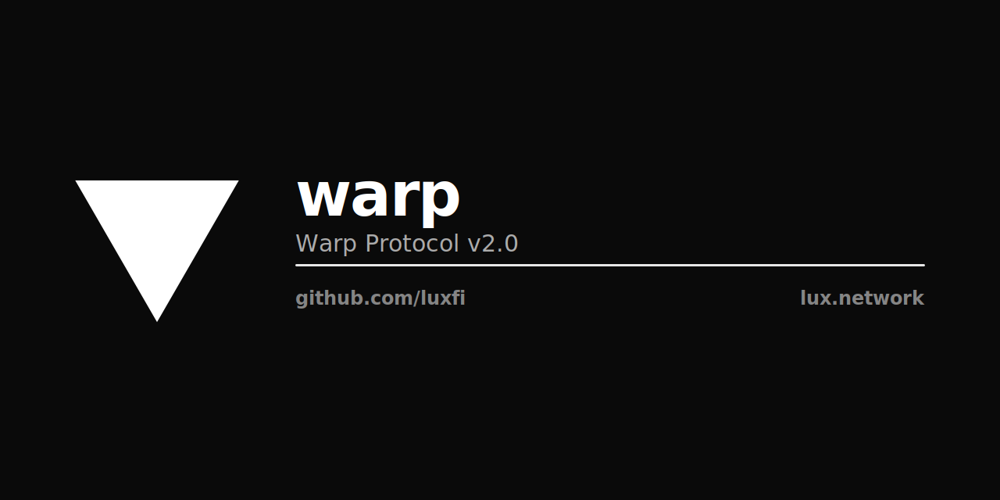

<p align="center"></p>

# Lux Warp — Cross-Chain Messaging (Tier A)

> Lux is not merely adding post-quantum signatures to a chain; it defines a hybrid finality architecture for DAG-native consensus, with protocol-agnostic threshold lifecycle, post-quantum threshold sealing, and cross-chain propagation of Horizon finality.

See [LP-105 §Claims and evidence](https://github.com/luxfi/lps/blob/main/LP-105-lux-stack-lexicon.md#claims-and-evidence) for the canonical claims/evidence table and the ten architectural commitments — single source of truth.

Cross-chain messaging protocol for the Lux Network. Source-chain
validators sign an outbound message; the destination chain verifies
the signature against the source's registered validator set.

**Status**: Tier A (production wire format, PQ-native posture default).

**Tier A submission docs**:

- [SUBMISSION.md](SUBMISSION.md) — cover sheet, scope, headline claim.
- [PROOF-CLAIMS.md](PROOF-CLAIMS.md) — what is and is NOT established.
- [TRUSTED-COMPUTING-BASE.md](TRUSTED-COMPUTING-BASE.md) — TCB inventory.
- [PATENTS.md](PATENTS.md) — royalty-free grant.
- [CRYPTOGRAPHER-SIGN-OFF.md](CRYPTOGRAPHER-SIGN-OFF.md) — review verdict (APPROVED WITH GATES).
- [DEPLOYMENT-RUNBOOK.md](DEPLOYMENT-RUNBOOK.md) — operator guide.
- [SPECIFICATION.md](SPECIFICATION.md) — wire format.
- [PQ_PROFILES.md](PQ_PROFILES.md) — posture taxonomy.
- [LEGACY-CLASSICAL.md](LEGACY-CLASSICAL.md) — classical opt-in policy.
- [TRANSPORT.md](TRANSPORT.md) — transport-layer integration notes.
- [CHANGELOG.md](CHANGELOG.md) — Tier A push notes.

**PQ-native posture**: the canonical signature registry constructor
`signature.NewPQNativeRegistry()` is PQ-native by construction.
ML-DSA-65 is preferred; classical primitives (BLS, Ed25519,
secp256k1) require an explicit `Config.LegacyClassicalEnabled` opt-in.
See `LEGACY-CLASSICAL.md` for the policy and deprecation timeline.

**Related modules**:

- [`luxfi/pulsar`](https://github.com/luxfi/pulsar) — Pulsar R-LWE threshold kernel (powers the Pulse lane).
- [`luxfi/corona`](https://github.com/luxfi/corona) — Corona R-LWE threshold (alternate Pulse implementation).
- [`luxfi/magnetar`](https://github.com/luxfi/magnetar) — SLH-DSA certificate profile.
- [`luxfi/quasar`](https://github.com/luxfi/quasar) — Quasar consensus engine (consumes warp envelopes for Horizon finality).
- [`luxfi/pq`](https://github.com/luxfi/pq) — canonical `pq.Mode` and posture gate (`pq.ValidateMode`).
- [`luxfi/zap`](https://github.com/luxfi/zap) — inter-node transport for warp envelopes (see `TRANSPORT.md`).

## Lanes

There is exactly ONE envelope (`Envelope`) carrying a `Message` plus
three signature lanes over a common digest `D`:

| Lane | Primitive | Required | Source |
|---|---|---|---|
| **Beam** | BLS12-381 aggregate + signer bitmap (LP-075) | always | `signature.go` |
| **Pulse** | Pulsar / Corona R-LWE threshold signature | optional (PQ) | `pulsar/` |
| **MLDSACertSet** | per-validator ML-DSA-65 attestations (FIPS 204) | optional (PQ) | `envelope.go` + caller verifier |

The Beam is the fast classical path. The two PQ lanes (Pulse,
MLDSACertSet) are the Prism-bound hybrid evidence — all three lanes
sign the SAME digest `D`, each under its own domain-separation tag,
so the lineage folded into `Message` is authenticated by every lane
(LP-105 §"Warp evolution"). **Warp Private** carries a Z-Chain FHE
ciphertext as the `Message.Payload` in the same envelope format
(production-research; LP-021v2 forthcoming).

## Architecture

```
github.com/luxfi/warp
├── message.go         Message — the signed subject (folds the PQ lineage)
├── codec.go           ZAP domain constants + digest D construction
├── zap.go             ZAP canonical-TLV wire codec (the ONE codec)
├── signature.go       BitSetSignature (Beam), BLS signing functions
├── validator.go       Validator, CanonicalValidatorSet, ValidatorState
├── envelope.go        Envelope — the single signed wire object + verifiers
├── security_profile.go  HasPQEvidence, LanesForMode (posture router)
├── verifier.go        Verifier interface
├── handler.go         P2P Handler interface
├── pulsar/            Pulse path (KernelVerifier over PulseSigningBytes(D))
├── payload/           Payload types (AddressedCall, Hash, ...)
├── backend/           Backend, MemoryBackend, ChainBackend
├── signer/            Signer interface (LocalSigner, RemoteSigner)
├── signature-aggregator/  Signature aggregation API
├── relayer/           Message relaying
├── precompile/        EVM precompile integration
├── docs/              Fumadocs documentation site
└── cmd/               CLI tools + KAT oracle
```

The `pulsar/` subpackage is split out so the root `warp` package does
not import the Pulsar kernel directly — the dispatch surface is the
small `PulseVerifier` interface; the concrete kernel-driven verifier
lives in `pulsar/`.

## Wire format

```
            +-----------------------------+
incoming -> | magic == "LWZP"‖0x01 ?      |
            +-----------------------------+
                 |yes              |no
                 v                 v
            ParseEnvelope      reject (legacy RLP / unknown)
                 |
                 v
            Envelope (Beam always present; PQ lanes when carried)
```

There is one parser (`ParseEnvelope`) and one digest (`D`). Legacy
RLP bytes (lead `0xc0..0xff`) and the legacy `0x02` `EnvelopeV2` byte
are rejected at the magic check — see `SPECIFICATION.md` §"Legacy".

## Properties

* **Single envelope**: `ParseEnvelope` returns an `Envelope` with the
  Beam lane populated; the PQ fields are the empty `u32(0)` frame when
  absent, and `HasPulse()` / `HasMLDSACertSet()` report their presence.
* **ID stability**: `Envelope.ID()` returns the same `D` as the
  embedded `Message.ID()` (recomputed from the struct, never sliced
  from the wire), so destination-chain replay protection is uniform.
* **No backward compatibility**: ZAP is forward-only; a legacy-only
  verifier cannot parse a ZAP envelope and vice-versa.

## Verifying an envelope

The standard verification chain (`warp.VerifyWithOptions`) checks
lanes in order:

1. Structural envelope invariants (`Envelope.Verify`).
2. Hash-suite consistency (when caller pins `HashSuiteID`).
3. Beam lane (`VerifyEnvelope`): BLS aggregate over
   `BeamSigningBytes(D)` vs the source-chain validator set + quorum.
4. ML-DSA cert set lane (when configured / required).
5. Pulsar Pulse lane (when configured / required).

A receiver that has already validated the Beam through a separate
code path can call `warp.VerifyPQLanes` to layer in PQ-lane checks
without re-running BLS aggregate verification.

## Pulse path (`warp/pulsar`)

The Pulse binds to the source-chain Pulsar lineage. The Pulse subject
is `warp.PulseSigningBytes(D) = "LUX-WARP-ZAP-PULSE-v1" ‖ D`. Because
`D` is computed over the full `Message` c14n — NetworkID,
SourceChainID, SourceNebulaRoot, SourceKeyEraID, SourceGeneration,
HashSuiteID, Payload — verifying the Pulse over `PulseSigningBytes(D)`
binds it to every one of those fields; no separate transcript-binding
step is required.

`pulsar.KernelVerifier` resolves the source-chain GroupKey + HashSuite
for `(SourceChainID, SourceKeyEraID, SourceGeneration)` via the
`pulsar.GroupKeyResolver` interface — a destination-chain contract
that records the source's GroupKey lineage as it evolves through
Bootstrap, Reshare, and Reanchor events (LP-073 §"Key-Era Lifecycle").

## Usage

```go
import (
    "github.com/luxfi/warp"
    warppulsar "github.com/luxfi/warp/pulsar"
)

// Build + sign the Beam:
msg, _ := warp.NewMessage(networkID, sourceChainID, payload)
env, _ := warp.SignMessage(msg, signers, validators)
wire, _ := env.Bytes()

// Receiver:
parsed, _ := warp.ParseEnvelope(wire)
err := warp.VerifyWithOptions(parsed, warp.VerifyOptions{
    NetworkID:      networkID,
    ValidatorState: validatorState,
    QuorumNum:      2,
    QuorumDen:      3,
    Pulse:          warppulsar.NewKernelVerifier(myResolver),
    RequirePulse:   true,
})
```

Callers that bind a specific Pulsar lineage construct the `Message`
struct directly with the resolved `SourceNebulaRoot`,
`SourceKeyEraID`, `SourceGeneration`, and `HashSuiteID`, then assemble
the envelope with `warp.NewEnvelope(msg, beam, pulseBytes, certSetBytes)`.

## References

* LP-021 — Warp classical Beam-only cross-chain messaging (legacy lineage).
* LP-021v2 — Warp hybrid envelope (this implementation; wire format in
  `SPECIFICATION.md`, vocabulary in LP-105 §"Warp evolution").
* LP-073 — Pulsar lattice threshold kernel.
* LP-075 — BLS aggregate (Beam).
* LP-105 — Lux Stack Lexicon (Beam, Pulse, Prism, Horizon, etc.).

## Module path

`github.com/luxfi/warp`. Build & test with `GOWORK=off go test ./...`.
